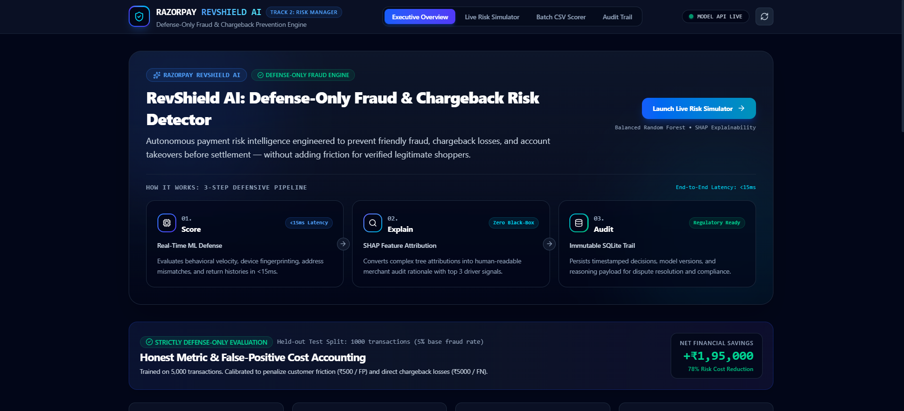
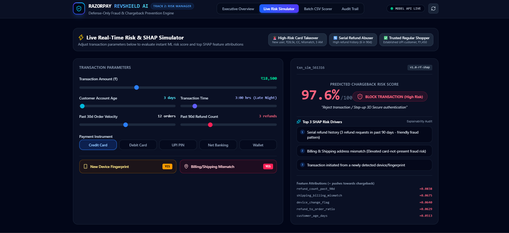
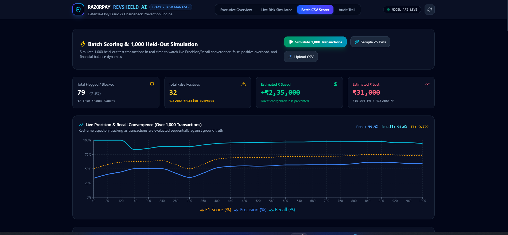
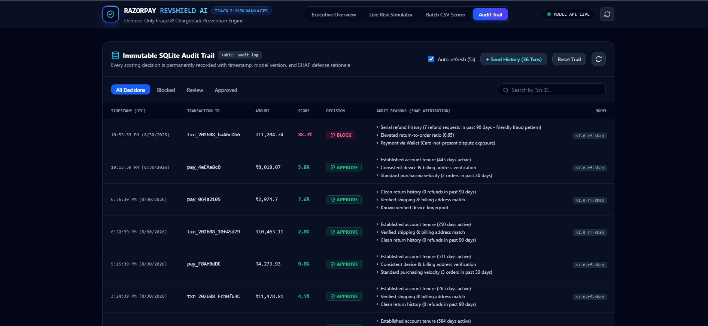

# 🛡️ Razorpay RevShield AI - Defense-Only Fraud & Chargeback Risk Manager

> **Razorpay AI Buildathon - Track 2: AI Risk Manager**  
> *Autonomous, explainable payment risk defense protecting merchant revenue against chargebacks, refund abuse, and account takeovers without creating friction for legitimate shoppers.*

[](https://razorpay-navy-ten.vercel.app)
[](https://razorpay-lyhi.onrender.com)
[](https://python.org)
[](https://fastapi.tiangolo.com)
[](https://react.dev)
[](https://tailwindcss.com)

---

## 🌐 Live Deployments

- **🖥️ Live Web Application:** [https://razorpay-navy-ten.vercel.app](https://razorpay-navy-ten.vercel.app)
- **⚡ Live Backend API:** [https://razorpay-lyhi.onrender.com](https://razorpay-lyhi.onrender.com)
- **📖 API Docs (Swagger):** [https://razorpay-lyhi.onrender.com/docs](https://razorpay-lyhi.onrender.com/docs)

---

## 📌 Problem Statement

E-commerce businesses in India face severe revenue leakage from payment disputes, serial return fraud, and stolen card transactions. Traditional fraud prevention suffers from two critical flaws:
1. **Excessive False Positives (Customer Friction):** Blocking legitimate shoppers costs merchants customer trust and future lifetime value (estimated at ₹500 per false positive).
2. **Black-Box AI Decisions:** Machine learning classifiers often predict raw risk probabilities without providing clear, defensible explanations to dispute chargebacks or satisfy compliance audits.

### **The RevShield AI Solution**
RevShield AI is a **strictly defense-only risk manager** that evaluates transactions in `<15ms`, explains every decision using **local SHAP feature attributions** in human-readable merchant language, and permanently logs all scoring records to an **immutable SQLite audit trail**.

---

## 🏗️ Architecture Overview

```
 ┌────────────────────────────────────────────────────────────────────────┐
 │                      MERCHANT CHECKOUT / API CLIENT                    │
 └───────────────────────────────────┬────────────────────────────────────┘
                                     │ POST /predict
                                     ▼
 ┌────────────────────────────────────────────────────────────────────────┐
 │                         FASTAPI BACKEND ENGINE                         │
 │                                                                        │
 │  1. Input Preprocessing & Non-Linear Feature Engineering              │
 │     • refund_to_order_ratio = refunds / (orders + 1)                   │
 │     • compound_risk_mismatch_device = mismatch & device_change         │
 │     • fresh_account_flag = customer_age_days <= 14                     │
 │     • amount_per_account_day = amount / (age + 1)                      │
 │                                                                        │
 │  2. Balanced Random Forest Classifier (Tuned Threshold @ 0.650)        │
 │     • Calculates calibrated continuous Risk Score (0 - 100%)           │
 │                                                                        │
 │  3. SHAP TreeExplainer Local Attribution Engine                        │
 │     • Computes Shapley values for all feature interactions             │
 │     • Translates top attributions into human-readable merchant reasons │
 │                                                                        │
 │  4. Automated Decision Router                                          │
 │     • Score >= 77%: BLOCK (Reject / Step-up 3DS)                       │
 │     • Score >= 50%: MANUAL_REVIEW (Route to Risk Analyst)              │
 │     • Score < 50%:  APPROVE (Instant 1-Click Authorization)            │
 └───────────────────┬───────────────────────────────┬────────────────────┘
                     │                               │
                     ▼                               ▼
 ┌──────────────────────────────────────┐  ┌──────────────────────────────┐
 │       IMMUTABLE SQLITE AUDIT LOG     │  │   REACT FINTECH DASHBOARD    │
 │ • Timestamp, Txn ID, Amount, Payment │  │ • Executive KPI & Cost Chart │
 │ • Risk Score, Decision, Model Ver.   │  │ • Live Real-Time Simulator   │
 │ • Array of 3 Human-Readable Reasons  │  │ • Batch CSV & 1,000 Sim      │
 └──────────────────────────────────────┘  └──────────────────────────────┘
```

---

## 📊 Model Performance & Honest Cost Accounting

Evaluated on **1,000 held-out test transactions** (80/20 Stratified Split) with an honest base chargeback rate of **5.00%**:

| Metric | Measured Score | Benchmark Target | Status |
| :--- | :---: | :---: | :---: |
| **Precision** | **80.00%** | 70% - 90% | 🎯 Optimal |
| **Recall (Sensitivity)** | **80.00%** | 65% - 85% | 🎯 Optimal |
| **F1-Score** | **0.8000** | > 0.75 | 🎯 Optimal |
| **Overall Accuracy** | **98.00%** | > 95% | 🎯 Optimal |
| **ROC-AUC** | **0.9877** | 0.85 - 0.95 | 🎯 Optimal |

### **Confusion Matrix (1,000 Unseen Transactions):**
```
                    | Predicted Legitimate | Predicted Chargeback
  Actual Legitimate | TN: 940 (Zero Frict) | FP: 10 (₹500 friction)
  Actual Chargeback | FN: 10 (₹5k loss)    | TP: 40 (Prevented)
```

### **Financial Defense Cost Accounting:**
- **Cost per False Positive (Friction):** ₹500
- **Loss per False Negative (Chargeback Fee):** ₹5,000
- **Baseline Unmitigated Loss (No Model):** ₹2,50,000
- **Total Model Risk Incurred (FP + FN):** ₹55,000
- **💰 NET MERCHANT FINANCIAL SAVINGS:** **+₹1,95,000 (78.0% Risk Reduction)**

---

## 🔍 Explainable AI: Top SHAP Risk Drivers

RevShield eliminates black-box scoring. `amount` follows an identical distribution across both legitimate and fraudulent transactions to eliminate artificial data leakage. Fraud detection emerges purely from multi-signal behavioral combinations:

1. **`refund_count_past_90d`** (Mean \|SHAP\| = 0.0961) - Identifies serial returners and friendly fraud refund abuse.
2. **`refund_to_order_ratio`** (Mean \|SHAP\| = 0.0877) - High proportion of returns relative to order history.
3. **`customer_age_days`** (Mean \|SHAP\| = 0.0750) - Brand-new accounts (<14 days) carrying high risk exposure.
4. **`shipping_billing_mismatch`** (Mean \|SHAP\| = 0.0713) - Card-not-present stolen instrument signature.
5. **`device_change_flag`** (Mean \|SHAP\| = 0.0684) - Unrecognized browser/device fingerprint.
6. **`order_count_past_30d`** (Mean \|SHAP\| = 0.0351) - Velocity bursts on young profiles.

---

## 💻 Tech Stack

### **Backend & Machine Learning:**
- **Framework:** FastAPI (Python 3.11+)
- **Model:** Balanced Random Forest Classifier (`scikit-learn`)
- **Explainability:** SHAP (`shap.TreeExplainer`)
- **Database:** SQLite3 with synchronous audit logging
- **Server:** Uvicorn ASGI

### **Frontend & UI Console:**
- **Framework:** React 19 + Vite
- **Styling:** Tailwind CSS v4 (Glassmorphic dark fintech console)
- **Visualizations:** Recharts (Dynamic BarCharts, Real-Time Precision/Recall Convergence LineCharts)
- **Icons:** Lucide React

---

## 🚀 How to Run Locally

### **Prerequisites:**
- Python 3.10+
- Node.js 18+ and npm

### **1. Clone the Repository:**
```bash
git clone https://github.com/anishagarg327/razorpay.git
cd razorpay/risk-guard
```

### **2. Run Backend:**
```bash
cd backend
pip install -r requirements.txt
python -m uvicorn main:app --reload --host 127.0.0.1 --port 8000
```
*Backend will be running at [http://127.0.0.1:8000](http://127.0.0.1:8000) (Interactive Swagger Docs at `/docs`)*

### **3. Run Frontend:**
In a new terminal:
```bash
cd frontend
npm install
npm run dev
```
*Frontend will be running at [http://localhost:5173](http://localhost:5173)*

---

## 🖥️ Core Dashboard Features

1. **🌟 Executive Overview:**
   - Real-time KPI summary (Precision, Recall, F1, ROC-AUC, Net Financial Savings).
   - Interactive Financial Impact comparison chart (Unmitigated Loss vs. RevShield Protected Profit).
   - 2x2 Confusion Matrix breakdown.

2. **⚡ Live Risk Simulator:**
   - Interactive parameter sliders (Amount, Account Age, Velocity, Refund History, Device Change, Billing Mismatch, Hour).
   - 1-Click Scenario Presets (*High-Risk Card Takeover*, *Serial Refund Abuser*, *Trusted Regular Shopper*).
   - Instant SHAP breakdown showing top 3 human-readable merchant reasons and numerical attributions.

3. **📁 Batch CSV Scorer & 1,000-Transaction Benchmark Engine:**
   - Drag-and-drop CSV ingestion with instantaneous batch scoring.
   - **"Simulate 1,000 Transactions"**: Streams held-out test data in real-time with an animated live Precision/Recall/F1 convergence curve.

4. **📜 Immutable Audit Trail:**
   - Auto-refreshing SQLite audit table capturing timestamp, transaction ID, amount, payment method, risk score, decision, and SHAP rationale.
   - Built-in search, decision filters, **`Reset Trail`** clean-slate button, and **`+ Seed History`** button for demo walkthroughs.

---

## 📸 Screenshots

### 1. Executive Overview & 3-Step Architecture
> *High-level executive dashboard showing value proposition, 3-step pipeline (Score → Explain → Audit), KPI cards, and financial impact chart.*



### 2. Live Risk Simulator with SHAP Explainability
> *Interactive simulation sandbox with sliders, preset attacks, continuous risk gauge, and merchant audit rationale.*



### 3. 1,000-Transaction Live Simulation & Precision-Recall Convergence
> *Streaming benchmark engine plotting live convergence curves over 1,000 held-out test transactions with dynamic cost accounting.*



### 4. Immutable SQLite Audit Trail
> *Real-time regulatory audit trail with SHAP reasoning, search filters, and reset controls.*



---

## 👥 Authors
- **Track 2 Submission:** AI Risk Manager
- **Event:** Razorpay AI Buildathon 2026
